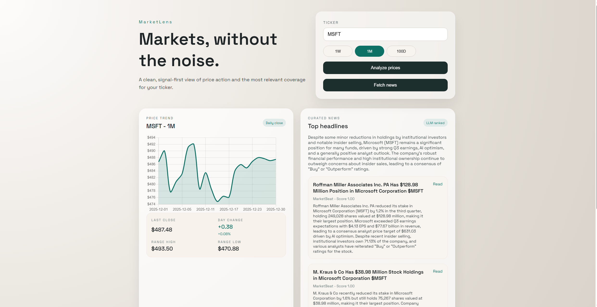

# MarketLens

Lightweight stock market dashboard with a FastAPI backend and a Next.js frontend.

## Dashboard Preview

## Live Demo

- [Live Demo](https://mlens.vercel.app)
- Note: The backend is on Render's free tier and will sleep after 15 minutes of inactivity. First request can take ~1 minute to wake up.

## Architecture

- `backend/`: FastAPI service with versioned REST routes under `/api/v1`. It calls Alpha Vantage for daily prices and news, normalizes responses with Pydantic models, applies simple relevance scoring, and uses Gemini for headline summarization.
- `frontend/`: Next.js (App Router) UI that calls the API, renders a price trend chart with Chart.js, and displays curated headlines plus a summary. Requests are throttled client-side to reduce rate-limit errors.

## Setup

### Backend

1. `cd backend`
2. `python -m venv .venv`
3. `./.venv/Scripts/activate`
4. `pip install -r requirements.txt`
5. Copy `backend/.env.example` to `backend/.env` and add keys.
6. `uvicorn app.main:app --reload`

### Frontend

1. `cd frontend`
2. `npm install`
3. `npm run dev`

Open `http://localhost:3000` to view the dashboard.
The frontend expects the API at `http://localhost:8000/api/v1`.

## Environment Variables

- `ALPHAVANTAGE_API_KEY`: Alpha Vantage market data.
- `GEMINI_API_KEY`: Gemini API access for summaries.
- `GEMINI_MODEL`: Optional model override (default in code).
- `NEXT_PUBLIC_API_BASE`: Frontend API base URL (e.g., `https://<render-url>/api/v1`).

## Deployment

- Backend (Render): deploy `backend/` with `uvicorn app.main:app --host 0.0.0.0 --port $PORT`.
- Frontend (Vercel): deploy `frontend/` as a Next.js app.
- Set `NEXT_PUBLIC_API_BASE` in Vercel to your Render URL + `/api/v1`.
- Verify backend health at `https://<render-url>/api/v1/health`.

## API Endpoints

- `GET /api/v1/health`: health check.
- `GET /api/v1/prices?ticker=MSFT&range=1M`: price series.
- `GET /api/v1/news?ticker=MSFT`: curated headlines + summary.

## Notes

- Alpha Vantage and Gemini can rate-limit or return upstream errors; the API will surface these as 502s.
- Supported price ranges: `1W`, `1M`, `100D`.
